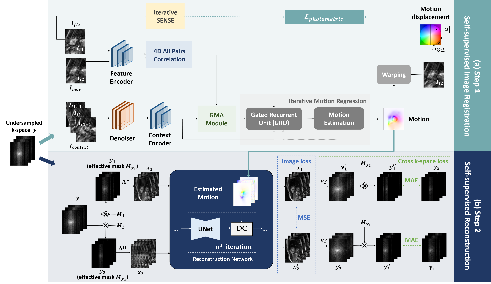

# SSL-MoCo

**Self-supervised motion-compensated reconstruction for cardiac Cine MRI**

> Official Tensorflow implementation of our paper published in *Reconstruction and Imaging Motion Estimation (RIME)* workshop in conjunction with *the 28th International Conference on Medical Image Computing and Computer Assisted Intervention (MICCAI 2025)*.

✏️ **Authors**: Siying Xu, Aya Ghoul, Kerstin Hammernik, Jens Kübler, Patrick Krumm, Andreas Lingg, Daniel Rueckert, Sergios Gatidis, and Thomas Küstner  

---

## 🔧 Overview

**SSL-MoCo** is a two-step self-supervised framework for cardiac Cine MR image reconstruction from undersampled k-space data. It does **not require any fully-sampled images** during training.


Fig.1 Proposed SSL-MoCo framework. (a) Step 1: Self-supervised image registration network with the photometric loss to minimize the differences between the reconstructed fixed image and the motion-corrected moving image. (b) Step 2: Self-supervised reconstruction network. Estimated motion fields from the first step are incorporated into the data consistency of the physics-based unrolled network using the forward and adjoint warp operations. The loss is composed of an image consistency loss and a cross k-space loss.

### Step 1: Self-supervised Image Registration

- Goal: learn non-rigid inter-frame motion
- Based on [GMA-RAFT](https://ieeexplore.ieee.org/abstract/document/10491317)
- Reference images approximated by iterative SENSE reconstruction from undersampled k-space

### Step 2: Self-supervised Motion-compensated Reconstruction

- Goal: self-supervised motion-sompensated reconstruction
- Incorporate the learned motion into the data consistency layers of the unrolled reconstruction network
- Self-supervision through image consistency loss and cross k-space loss

## 📌 Note

This repository **only contains the code for Step 2: self-supervised motion-compensated reconstruction**.

- The registration step is **not included** in this repository.  
- Please refer to the [GMARAFT](https://github.com/lab-midas/GMARAFT) implementation for motion estimation.  
- In our setting, since we do not have access to fully-sampled images, we approximate the reference using **iterative SENSE reconstruction** from undersampled k-space.


---

## 📁 Project Structure

```bash
SSL-MoCo/
├── ablation/
│   ├── no_MC_SSL.py              # Ablation without motion compensation
├── data_loader/
│   ├── MC_SSL_Dataloader.py      # Data loader for proposed method
│   └── no_MC_SSL_Dataloader.py   # Data loader for ablation
├── model/
│   ├── MC_SSL.py                 # Main model and training script
│   ├── complex_unet.py           # compleax-valued UNet 
│   └── one_dim_callbacks.py      # Training callbacks (e.g., weights saving)
├── utils/
│   ├── DCPM_mri.py               # Forward/backward operators for data consistency layer
│   ├── fft.py                    # Fourier transforms
│   ├── motion_mri.py             # Forward/backward operators for motion-compensated data consistency layer
│   ├── mri.py                    # MRI-related operators
│   ├── my_utils.py               # Loss functions
│   └── my_warp.py                # Warping operators
└── README.md
```

---

## 🧩 Dependencies

This code was implemented with the following versions:

- Python 3.7
- TensorFlow 2.6.0
- Keras 2.6.0
- NumPy, Pandas, Matplotlib, etc.
- **[merlintf](https://github.com/midas-research/merlintf)** (must be installed manually)

> ⚠️ `merlintf` is **not** available on PyPI. Please follow its GitHub installation instructions.

---

## 📂 Dataset

We use an **in-house 2D cardiac Cine MR dataset** which cannot be released publicly due to institutional restrictions.

To reproduce or benchmark, you may consider publicly available alternatives such as:

- [OCMR](https://www.ocmr.info/)
- [CMRxRecon](https://www.synapse.org/Synapse:syn51471091/wiki/622170)

If you're interested in collaboration or data access, please contact the authors.

---

## 🎤 Presentation

Coming soon.

---

## 📝 Citation

*Citation information will be updated soon.*

## 📬 Contact

For questions or collaboration opportunities, feel free to reach out to Siying Xu at siying.xu@med.uni-tuebingen.de
